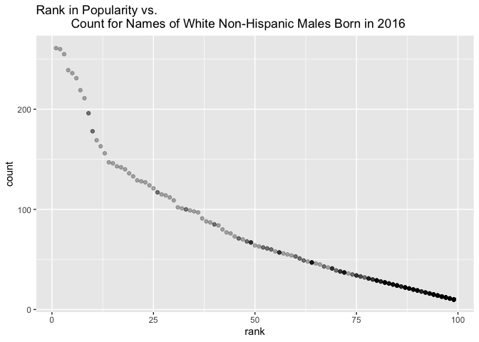

p8105\_hw2\_rr3423
================
Ragyie Rawal
10/6/2021

## PROBLEM 1

### Mr. Trash Wheel:

``` r
# importing and cleaning excel file data for Mr. Trash Wheel dataset 
mr_trash_wheel_df = 
  read_excel("data/Trash-Wheel-Collection-Totals-7-2020-2.xlsx",
             sheet = "Mr. Trash Wheel",
             range = "A2:N535") %>% 
  janitor::clean_names() %>% 
  filter(!str_detect(month, 'Total')) %>% 
  mutate(sports_balls = round(sports_balls))
```

### Precipitation Data 2018:

``` r
# reading and cleaning the excel precipitation data for 2018 
precipitation_2018_df = 
  read_excel("data/Trash-Wheel-Collection-Totals-7-2020-2.xlsx",
             sheet = "2018 Precipitation",
             range = "A2:B15") %>% 
  janitor::clean_names() %>% 
  mutate(year = "2018") %>% 
  drop_na()
```

### Precipitation Data 2019:

``` r
# reading and cleaning the excel precipitation data for 2019 
precipitation_2019_df = 
  read_excel("data/Trash-Wheel-Collection-Totals-7-2020-2.xlsx",
             sheet = "2019 Precipitation",
             range = "A2:B15") %>% 
  janitor::clean_names() %>% 
  mutate(year = "2019") %>% 
  drop_na()
```

### Combining precipitation datasets:

``` r
# combining precipitation datasets and converting month to a character variable
precipitation_df =
  bind_rows(precipitation_2018_df, precipitation_2019_df) %>% 
  mutate(month = month.name[month]) %>% 
  relocate(month, year, total)
```

### Data summary

``` r
# creating variables for variable names, total precipitation, median, mean, row, columns for precipitation 18
names_p18 = precipitation_2018_df %>% names()
precipitation_18_total = precipitation_2018_df %>% summarise(sum(total))
p18_median = precipitation_2018_df %>% summarise(median(total))
p18_mean = precipitation_2018_df %>% summarise(mean(total))
p18_row = precipitation_2018_df %>% nrow()
p18_col = precipitation_2018_df %>% ncol()

# creating variables for variable names, total precipitation, median, mean, row, columns for precipitation 18
names_p19 = precipitation_2019_df %>% names()
precipitation_19_total = precipitation_2019_df %>% summarise(sum(total))
p19_median = precipitation_2019_df %>% summarise(median(total))
p19_mean = precipitation_2019_df %>% summarise(mean(total))
p19_row =  precipitation_2019_df %>% nrow()
p19_col = precipitation_2019_df %>% ncol()

# creating variables for names, rows, and columns for mr. trash wheel dataset 
names_trash = mr_trash_wheel_df %>% names()
trash_rows = mr_trash_wheel_df %>% nrow()
trash_columns = mr_trash_wheel_df %>% ncol()

# finding the median sport balls in 2019 
median_sports_balls = mr_trash_wheel_df %>% 
  filter(year == 2019) %>% 
  summarise(median(sports_balls))
```

The **variable names** in the precipitation 2018 data are **month,
total, year**. The **total precipitation** in 2018 was **70.33**. The
**median** precipitation in 2018 was **5.455**. The **mean**
precipitation in 2018 was **5.8608333**. The number of **rows** in the
precipitation 2018 data is **12**. The number of **columns** in the
precipitation 2018 data is **3**.

The **variable names** in the precipitation 2019 data are **month,
total, year**. The **total precipitation** in 2019 was **33.95**. The
**median** precipitation in 2019 was **3.335**. The **mean**
precipitation in 2019 was **2.8291667**. The number of **rows** in the
precipitation 2019 data is **12**. The number of **columns** in the
precipitation 2019 data is **3**.

The **variable names** in the Mr. Trash Wheel data are **dumpster,
month, year, date, weight\_tons, volume\_cubic\_yards, plastic\_bottles,
polystyrene, cigarette\_butts, glass\_bottles, grocery\_bags,
chip\_bags, sports\_balls, homes\_powered**. The number of **rows** in
the Mr. Trash Wheel data is **453**. The number of **columns** in the
Mr. Trash Wheel data is **14**. The **median number of sports balls** in
a dumpster in 2019 is **9**.

## PROBLEM 2

### Cleaning data in pols-month.csv

``` r
# importing pols-month dataset, then cleaning the data using separate, mutate, and select functions 
pols_month_df = 
  read_csv("data/fivethirtyeight_datasets/pols-month.csv") %>% 
  janitor::clean_names() %>% 
  separate(col = mon, into = c("year", "month", "day")) %>%
  mutate(across(.col = c(year, month, day), as.integer)) %>% 
  mutate(month = month.name[month]) %>% 
  mutate(president = case_when(prez_dem == 1 ~ "dem",
                               prez_gop == 1 ~ "gop",
                               prez_gop == 2 ~ "gop")) %>% 
  select(-prez_dem, -prez_gop, -day) %>%
  select(year, month, president, everything())
```

### Cleaning data in snp.csv

``` r
# importing the snp dataset, then cleaning the data using separate, mutate, and select functions 
snp_df = 
  read_csv("data/fivethirtyeight_datasets/snp.csv") %>% 
  janitor::clean_names() %>% 
  separate(date, sep = "/", into = c("month", "day", "year")) %>% 
  mutate(across(.col = c(month, day, year), as.integer)) %>% 
  mutate(month = month.name[month]) %>% 
  mutate(year = ifelse(year > 21, 1900 + year, 2000 + year)) %>% 
  select(-day) %>% 
  select(year, month, close, everything()) 
```

### Tidying data in unemployment.csv

``` r
# importing the unemployment dataset, then cleaning and tidying the data using pivot_longer and mutate functions 
unemployment_df = 
  read_csv("data/fivethirtyeight_datasets/unemployment.csv") %>% 
  janitor::clean_names() %>% 
  pivot_longer(
    jan:dec,
    names_to = "month",
    values_to = "unemployment percentage"
  ) %>% 
  mutate(across(.col = c(year), as.integer)) %>% 
  mutate(month = recode(month, "jan" = "January", "feb" = "February", "mar" = "March",
                        "apr" = "April", "may" = "May", "jun" = "June",
                        "jul" = "July", "aug" = "August", "sep" = "September",
                        "oct" = "October", "nov" = "November", "dec" = "December"))
```

### Merging pols-month, snp, and unemployment datasets

``` r
# merging the three datasets of interest using left_join two separate times 
merged_df_one = 
  left_join(pols_month_df, snp_df, by = c("year", "month"))

merged_538_df = 
  left_join(merged_df_one, unemployment_df, by = c("year", "month"))
```

### Data summary

``` r
# creating variables for names, dimension, and range of years for pols-month df 
names_pols = pols_month_df %>% names()
dimension_pols = pols_month_df %>%  dim()
range_pols = pols_month_df %>% 
  select(year) %>% 
  range()

# creating variables for names, dimension, and range of years for snp df 
names_snp = snp_df %>% names()
dimension_snp = snp_df %>% dim()
range_snp = snp_df %>% 
  select(year) %>% 
  range()

# creating variables for names, dimension, and range of years for unemployment df 
names_unemployment = unemployment_df %>% names() 
dimension_unemployment = unemployment_df %>% dim()
range_unemployment = unemployment_df %>% 
  select(year) %>% 
  range()

# dimension for merged dataset 
dimension_merged = merged_538_df %>% dim()
```

The pols-month dataset contains data regarding the number of national
politicians who are democratic or republican at any time. The **names of
key variables** in the pols-month dataset are **year, month, president,
gov\_gop, sen\_gop, rep\_gop, gov\_dem, sen\_dem, rep\_dem**. The
**dimension** of the pols-month dataset are **822, 9**. The **range of
years** in the pols-month dataset are **1947, 2015**.

The snp dataset contains data regarding the closing values of the S&P
stock index on associated dates. The **names of key variables** in the
snp dataset are **year, month, close**. The **dimension** of the snp
dataset are **787, 3**. The **range of years** in the snp dataset are
**1950, 2015**.

The unemployment dataset contains data regarding the percentage of
unemployment in months of the associated year. The **names of key
variables** in the unemployment dataset are **year, month, unemployment
percentage**. The **dimension** of the umemployment dataset are **816,
3**. The **range of years** in the unemployment dataset are **1948,
2015**.

The **dimension** of the merged dataset is **822, 11**.

## PROBLEM 3

### Loading and tidying popular baby names data

``` r
# formatting names of categorical predictor and case structure of string variables using mutate function
baby_names_df = 
  read_csv("data/Popular_Baby_Names.csv") %>% 
  janitor::clean_names() %>% 
  mutate(gender = str_to_sentence(gender),
         ethnicity = recode(ethnicity,"ASIAN AND PACI" = "ASIAN AND PACIFIC ISLANDER", 
                            "WHITE NON HISP" = "WHITE NON HISPANIC", 
                            "BLACK NON HISP" = "BLACK NON HISPANIC",
                            "ASIAN AND PACIFIC" = "ASIAN AND PACIFIC ISLANDER"),
         ethnicity = str_to_title(ethnicity),
         childs_first_name = str_to_sentence(childs_first_name))
```

### Removing any duplicated rows in this dataset

``` r
# removing duplicated rows in popular baby names dataset using distinct function
baby_names_df = 
  baby_names_df %>% distinct()
```

### Producing table showing rank in popularity of the name “Olivia” over time

``` r
olivia_table_df = 
  filter(baby_names_df, childs_first_name == "Olivia") %>% 
  select(-count) %>% 
  pivot_wider(
    names_from = "year_of_birth",
    values_from = "rank"
  ) %>% 
  select(childs_first_name, gender, ethnicity, "2011", "2012", "2013", "2014", "2015", "2016")

# displaying table 
knitr::kable(olivia_table_df)
```

| childs\_first\_name | gender | ethnicity                  | 2011 | 2012 | 2013 | 2014 | 2015 | 2016 |
|:--------------------|:-------|:---------------------------|-----:|-----:|-----:|-----:|-----:|-----:|
| Olivia              | Female | Asian And Pacific Islander |    4 |    3 |    3 |    1 |    1 |    1 |
| Olivia              | Female | Black Non Hispanic         |   10 |    8 |    6 |    8 |    4 |    8 |
| Olivia              | Female | Hispanic                   |   18 |   22 |   22 |   16 |   16 |   13 |
| Olivia              | Female | White Non Hispanic         |    2 |    4 |    1 |    1 |    1 |    1 |

### Producing table showing most popular name among male children over time

``` r
male_table_df =
  filter(baby_names_df, gender == "Male", rank == "1") %>% 
  select(-count) %>% 
  pivot_wider(
    names_from = "year_of_birth",
    values_from = "childs_first_name"
  ) %>% 
  select(rank, gender, ethnicity, "2011", "2012", "2013", "2014", "2015", "2016")

# displaying table 
knitr::kable(male_table_df)
```

| rank | gender | ethnicity                  | 2011    | 2012   | 2013   | 2014   | 2015   | 2016   |
|-----:|:-------|:---------------------------|:--------|:-------|:-------|:-------|:-------|:-------|
|    1 | Male   | Asian And Pacific Islander | Ethan   | Ryan   | Jayden | Jayden | Jayden | Ethan  |
|    1 | Male   | Black Non Hispanic         | Jayden  | Jayden | Ethan  | Ethan  | Noah   | Noah   |
|    1 | Male   | Hispanic                   | Jayden  | Jayden | Jayden | Liam   | Liam   | Liam   |
|    1 | Male   | White Non Hispanic         | Michael | Joseph | David  | Joseph | David  | Joseph |

### Producing a scatterplot for the dataset

``` r
# creating dataframe for scatterplot 
scatterplot_df = 
  filter(baby_names_df, gender == "Male", ethnicity == "White Non Hispanic", year_of_birth == "2016")

# creating scatterplot using ggplot 
number_scatterplot = 
  ggplot(scatterplot_df, aes(x = rank, y = count)) + 
  geom_point(alpha = 0.3) +
  ggtitle("Rank in Popularity vs. 
          Count for Names of White Non-Hispanic Males Born in 2016")

# displaying scatterplot 
number_scatterplot 
```

<!-- -->
